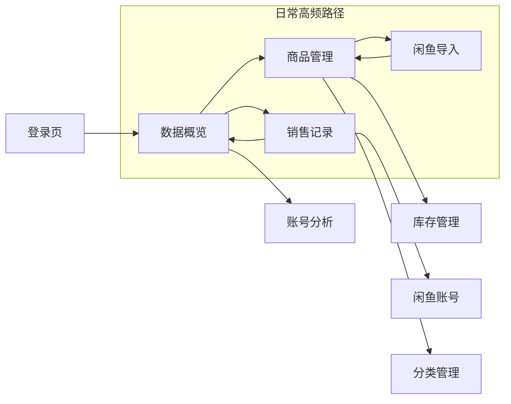

# 衣服管家 · 页面原型

| 项目 | 说明 |
|------|------|
| 文档版本 | v1.0 |
| 更新日期 | 2026-06-24 |
| 关联文档 | [产品文档](./产品文档.md) · [用户操作手册](./用户操作手册.md) |

> 本文档描述各页面的布局结构与交互元素，供设计与开发对齐。线框图为 ASCII 示意，实际 UI 以 Element Plus 组件实现为准。

---

## 0. 全局布局

所有登录后页面共用同一套后台框架。

```
┌──────────────────────────────────────────────────────────────────────────┐
│ ┌─────────────┐ ┌──────────────────────────────────────────────────────┐ │
│ │  衣  衣服管家 │ │ [≡]  首页 / 当前页面标题          [刷新][全屏][头像▼] │ │
│ │  卖家管理后台 │ ├──────────────────────────────────────────────────────┤ │
│ ├─────────────┤ │                                                      │ │
│ │ ● 数据概览   │ │                                                      │ │
│ │   商品管理   │ │              页面内容区（router-view）                 │ │
│ │   闲鱼导入   │ │                                                      │ │
│ │   库存管理   │ │                                                      │ │
│ │   销售记录   │ │                                                      │ │
│ │   闲鱼账号   │ │                                                      │ │
│ │   账号分析   │ │                                                      │ │
│ │   分类管理   │ │                                                      │ │
│ └─────────────┘ └──────────────────────────────────────────────────────┘ │
└──────────────────────────────────────────────────────────────────────────┘
  深色侧边栏 220px          顶栏 56px + 内容区（浅灰背景 #f0f2f5）
  可折叠为 64px
```

| 区域 | 元素 | 交互 |
|------|------|------|
| 侧边栏 Logo | 「衣」图标 + 衣服管家 | 固定展示 |
| 侧边栏菜单 | 8 个一级菜单 | 点击跳转，当前项高亮蓝色 |
| 顶栏左侧 | 折叠按钮 + 面包屑 | 折叠/展开侧边栏 |
| 顶栏右侧 | 刷新、全屏、用户下拉 | 刷新页面 / 全屏 / 退出登录 |

**列表页通用结构**（商品、库存、销售、账号、分类）：

```
┌─ PageContainer ─────────────────────────────────────────────┐
│  页面标题                              [操作按钮组]           │
├─────────────────────────────────────────────────────────────┤
│  ┌─ 搜索区（带边框）─────────────────────────────────────┐  │
│  │ [关键词] [下拉筛选...] [查询] [重置]                   │  │
│  └───────────────────────────────────────────────────────┘  │
├─────────────────────────────────────────────────────────────┤
│  ┌─ 表格（带边框、斑马纹）───────────────────────────────┐  │
│  │  列1 │ 列2 │ 列3 │ ... │ 操作                         │  │
│  │  ... │ ... │ ... │ ... │ [编辑][删除]                   │  │
│  └───────────────────────────────────────────────────────┘  │
│  共 N 条  < 1 2 3 >  每页 10/20/50 条                       │
└─────────────────────────────────────────────────────────────┘
```

---

## 1. 登录页 `/login`

**布局**：左右分屏，左侧品牌区 + 右侧表单区。

```
┌─────────────────────────────┬─────────────────────────────┐
│                             │                             │
│   ～～～ 波浪背景 ～～～      │      衣服管家               │
│                             │                             │
│   [衣] 衣服管家              │   ┌─────────────────────┐   │
│                             │   │  📧  邮箱 / admin    │   │
│   统一管理 · 清晰算账         │   │  🔒  密码            │   │
│   多号经营 · 数据驱动         │   │                     │   │
│                             │   │   [  登  录  ]       │   │
│                             │   └─────────────────────┘   │
│                             │   还没有账号？立即注册        │
└─────────────────────────────┴─────────────────────────────┘
        品牌 Banner（蓝紫渐变）              白色表单卡片
```

| 字段 | 说明 |
|------|------|
| 邮箱 | 普通用户填注册邮箱；超管可填 `admin` |
| 密码 | 必填 |
| 注册模式 | 切换后显示「确认密码」字段 |

**交互**：登录成功 → 跳转 `/dashboard`；已登录访问 `/login` → 自动跳转首页。

---

## 2. 数据概览 `/dashboard`

**目的**：首页一眼看全局经营数据。

```
┌─────────────────────────────────────────────────────────────┐
│  ┌──────────┐ ┌──────────┐ ┌──────────┐ ┌──────────┐       │
│  │ 商品数    │ │ SKU/库存  │ │ 库存货值  │ │ 本月净利润│       │
│  │   42     │ │ 68 / 120 │ │ ¥3,580  │ │ ¥1,256  │       │
│  │ 在售商品  │ │ 规格/件数 │ │ 按进价算  │ │ 销售额·利润率│     │
│  └──────────┘ └──────────┘ └──────────┘ └──────────┘       │
├─────────────────────────────────────────────────────────────┤
│  分析概览                                                    │
│  [本周][上周][本月][上月][自定义]  2026-06-01 ~ 2026-06-24   │
│  ┌──────────┐ ┌──────────┐ ┌──────────┐                     │
│  │卖出件数   │ │成交金额   │ │总利润     │                     │
│  │  18 件   │ │ ¥2,340  │ │ ¥890    │                     │
│  └──────────┘ └──────────┘ └──────────┘                     │
│  ┌─ 柱状图：卖出件数 / 成交金额 / 总利润（按日）──────────┐  │
│  │  ▓▓  ▓▓▓  ▓  ▓▓▓▓  ▓▓  ...                           │  │
│  └───────────────────────────────────────────────────────┘  │
├─────────────────────────────────────────────────────────────┤
│  闲鱼账号概览                                                │
│  [本周][上周][本月][上月][自定义]                             │
│  ┌─ 各账号卡片 ──────────────────────────────────────────┐  │
│  │ 主号 │ 成交 12 单 │ 利润 ¥680 │ 在售 15 │ 投入 ¥50    │  │
│  │ 清仓号│ 成交  3 单 │ 利润 ¥120 │ 在售  8 │ 投入 ¥0     │  │
│  └───────────────────────────────────────────────────────┘  │
├──────────────────────────────┬──────────────────────────────┤
│  最近销售（最新 5 条）         │  低库存预警                   │
│  日期│商品│渠道│成交额│利润     │  商品 / 规格 / 库存 / 预警值  │
└──────────────────────────────┴──────────────────────────────┘
```

| 模块 | 数据来源 | 刷新 |
|------|----------|------|
| 统计卡片 | 实时汇总 | 进入页面 / 顶栏刷新 |
| 分析概览 | 销售记录，按时段聚合 | 切换时段自动刷新 |
| 闲鱼账号概览 | 销售 + 账号 + 流量投入 | 切换时段自动刷新 |
| 最近销售 | 最新 5 条销售 | 同上 |
| 低库存预警 | 库存 ≤ 预警值的 SKU | 同上 |

---

## 3. 商品管理 `/products`

### 3.1 列表页

```
标题：商品管理                    [模版下载][数据导入][+ 新增商品]

搜索：名称/货号  分类▼  状态▼  来源▼  闲鱼账号▼  [查询][重置]

┌────┬────────────┬────┬──────┬────┬────┬────┬────┬──────┬────────┐
│图片│ 商品        │来源│ 价格  │SKU │库存│状态│账号│闲鱼链接│ 操作   │
├────┼────────────┼────┼──────┼────┼────┼────┼────┼──────┼────────┤
│[图]│ 碎花连衣裙   │自有│¥0~89│ 3  │ 5  │在售│主号│ 查看  │编辑 删除│
│[图]│ 牛仔外套     │进货│¥45~99│ 2 │ 8  │在售│清仓│  -   │编辑 删除│
└────┴────────────┴────┴──────┴────┴────┴────┴────┴──────┴────────┘
分页
```

**筛选字段**：关键词、分类、状态（在售/主动下架/售出下架）、来源（自有闲置/进货）、闲鱼账号。

### 3.2 新增/编辑弹窗（860px 宽）

```
┌─ 新增商品 / 编辑商品 ────────────────────────────────────────┐
│  商品名称*          分类▼                                     │
│  货号               商品来源*  ○自有闲置  ○进货               │
│                     （提示：自有闲置成本按 ¥0 计算）             │
│  状态▼              闲鱼账号▼                                 │
│  闲鱼链接                                                     │
│  备注（闲鱼标题、卖点等）                                      │
│  商品图片  [图1][图2][+上传]                                   │
│  ── SKU（颜色/尺码/进价·售价/库存）────────────────────────── │
│  ┌颜色┬尺码┬进价/成本┬售价┬库存┬预警值┬操作┐                  │
│  │均色 │均码│  0.00  │89 │ 1  │  2  │删除│                  │
│  └────┴────┴────────┴───┴────┴──────┴────┘                  │
│  [+ 添加 SKU]                                                 │
│                                    [取消]  [保存]             │
└───────────────────────────────────────────────────────────────┘
```

**规则**：
- 来源为「自有闲置」时，进价字段禁用且固定为 0
- 来源为「进货」时，进价必填
- 图片支持上传至云存储

---

## 4. 闲鱼导入 `/xianyu-import`

**目的**：粘贴闲鱼分享文案，快速建商品。

```
┌─ 1. 粘贴闲鱼分享文案 ────────────────────────────────────────┐
│  ┌─────────────────────────────────────────────────────────┐│
│  │ 【闲鱼】https://m.tb.cn/h.xxxxx?tk=xxx                  ││
│  │ HU108 「我在闲鱼发布了【Vintage复古背带裙】...」         ││
│  └─────────────────────────────────────────────────────────┘│
│  [获取商品信息]                                               │
│  支持 m.tb.cn 短链、goofish.com 链接及分享文案格式             │
└───────────────────────────────────────────────────────────────┘

（解析成功后显示第 2 步）

┌─ 2. 确认并修改商品信息 ──────────────────────────────────────┐
│  闲鱼链接*     [https://www.goofish.com/item?id=...]          │
│  商品名称*     [Vintage复古背带裙]                             │
│  商品售价*     [89.00]    进货价*（仅进货时显示）[45.00]       │
│  商品来源      ○自有闲置  ○进货                               │
│  闲鱼账号*     [主号 ▼]    分类 [裙子 ▼]                       │
│  商品状态      ○在售  ○主动下架  ○售出下架                     │
│  运费*（仅售出下架时显示） [8.00]                              │
│  闲鱼文案      [多行描述...]                                   │
│  商品图片      [URL 输入 + 添加]  [图1][图2][+上传]            │
│                          [重新解析]  [保存到商品管理]          │
└───────────────────────────────────────────────────────────────┘
```

**特殊逻辑**：
- 状态选「售出下架」→ 保存时**同时创建一条销售记录**（含运费、平台费）
- 解析失败时，仍可从文案提取商品名和描述作为兜底

---

## 5. 库存管理 `/inventory`

```
标题：库存管理

搜索：商品名称/规格  库存状态▼(全部/低库存/正常)  [查询][重置]

┌─ SKU 库存列表 ──────────────────────────────────────────────┐
│ 商品名称      │ 颜色 │ 尺码 │ 进价 │ 售价 │ 库存 │ 货值 │ 操作 │
│ 碎花连衣裙    │ 白   │ M   │ ¥0  │ ¥89 │  2  │ ¥0  │[调整]│
│ 牛仔外套      │ 蓝   │ L   │ ¥45 │ ¥99 │  8  │¥360 │[调整]│
└───────────────────────────────────────────────────────────────┘

┌─ 库存变动记录 ────────────────────────────────────────────────┐
│ 时间          │ 商品/规格        │ 类型   │ 数量 │ 备注      │
│ 2026-06-24   │ 碎花裙/白/M      │ 销售出库│ -1  │ 销售扣减  │
│ 2026-06-23   │ 牛仔外套/蓝/L    │ 入库   │ +5  │ 补货      │
└───────────────────────────────────────────────────────────────┘
```

### 库存调整弹窗

```
┌─ 调整库存 ────────────────────────────────────┐
│  商品：碎花连衣裙 / 白 / M                     │
│  类型：○入库  ○出库  ○调整                    │
│  数量：[  1  ]                                │
│  备注：[可选说明]                              │
│                        [取消]  [确认]          │
└───────────────────────────────────────────────┘
```

---

## 6. 销售记录 `/sales`

### 6.1 列表页

```
标题：销售记录              [模版下载][数据导入][+ 录入销售]

搜索：商品/备注  渠道▼  闲鱼账号▼  [查询][重置]

┌──────┬────────────┬────┬────┬────┬──┬────┬────┬──┬────┬────┬────┬──────┐
│下单日│ 商品/规格   │利润│账号│状态│量│售价│实际│运│平台│进价│渠道│ 操作  │
├──────┼────────────┼────┼────┼────┼──┼────┼────┼──┼────┼────┼────┼──────┤
│06-24 │碎花裙/白/M  │¥82 │主号│成功│1 │¥89 │¥89 │¥8│¥0.5│ ¥0│闲鱼│查看 编辑│
└──────┴────────────┴────┴────┴────┴──┴────┴────┴──┴────┴────┴────┴──────┘
```

利润颜色：绿色=正利润，红色=亏损，灰色=已退款。

### 6.2 录入销售弹窗（720px）

```
┌─ 录入销售 ──────────────────────────────────────────────────┐
│  卖出商品*  [碎花连衣裙 / 白 / M    ] [选择商品]              │
│  销售渠道   [闲鱼 ▼]                                          │
│  成交账号*  [主号 ▼]        下单日期  [2026-06-24]            │
│  订单状态   ○成功  ○有退款                                   │
│  数量       [1]             成交额*   [89.00]                 │
│  单件进价   [0.00]（自有闲置时禁用）                           │
│  平台服务费 [0.53]（闲鱼默认 0.6%）  运费 [8.00]              │
│  其他费用   [0.00]            预计利润  [ ¥80.47 ]           │
│  备注       [买家昵称等]                                      │
│                                    [取消]  [保存]             │
└───────────────────────────────────────────────────────────────┘
```

### 6.3 选择商品弹窗（880px）

```
搜索：[商品名称/颜色/尺码]                    共 68 个 SKU

┌────────────┬────┬────┬────┬────┬────┬────┐
│ 商品名称    │颜色│尺码│库存│售价│进价│操作│
│ 碎花连衣裙  │ 白 │ M  │ 2  │ ¥89│ ¥0 │选择│
└────────────┴────┴────┴────┴────┴────┴────┘
分页（点击行或「选择」按钮选中）
```

### 6.4 查看详情 / 编辑弹窗

- **查看**：只读描述列表，展示全部字段 + 闲鱼链接
- **编辑**：可改下单日期、成交账号、订单状态、实际售价、运费、平台费（商品不可改）

---

## 7. 闲鱼账号 `/accounts`

```
标题：闲鱼账号                              [+ 新增账号]

搜索：名称/备注  平台▼  [查询][重置]

┌──────────┬────┬──────┬────────┬────────┬────────────────────┐
│ 账号名称  │平台│ 状态  │ 备注    │流量投入 │ 操作               │
├──────────┼────┼──────┼────────┼────────┼────────────────────┤
│ 闲鱼主号  │闲鱼│ 启用  │卖新款   │ ¥150  │编辑 删除 [流量投入] │
│ 清仓2号   │闲鱼│ 启用  │清库存   │ ¥0    │编辑 删除 [流量投入] │
└──────────┴────┴──────┴────────┴────────┴────────────────────┘
```

### 新增/编辑账号弹窗

```
账号名称*  [闲鱼主号]
平台       [闲鱼 ▼]
状态       ☑ 启用
备注       [可选]
           [取消]  [保存]
```

### 流量投入弹窗

```
账号：闲鱼主号                    累计投入：¥150.00

[+ 新增投入]

┌──────────┬────────┬──────────┬────────┐
│ 投入日期  │ 金额   │ 备注      │ 操作   │
│ 2026-06-01│ ¥50   │ 曝光推广  │编辑 删除│
│ 2026-06-15│ ¥100  │ 擦亮     │编辑 删除│
└──────────┴────────┴──────────┴────────┘
```

---

## 8. 账号分析 `/account-analysis`

```
标题：账号分析

[本周][上周][本月][上月][自定义]  日期范围  2026-06-01 ~ 2026-06-24

┌─ 表现最好 ──────────────┐  ┌─ 需要关注 ──────────────┐
│  闲鱼主号                │  │  清仓2号                 │
│  利润 ¥680 · 成交 12 单  │  │  对比同时间段自动识别     │
└─────────────────────────┘  └─────────────────────────┘

┌─ 柱状图：各账号 成交额 vs 利润 ─────────────────────────────┐
│  主号 ▓▓▓▓▓▓▓   清仓号 ▓▓                                  │
└─────────────────────────────────────────────────────────────┘

┌账号──┬成交┬件数┬成交额┬利润──┬利润率┬客单价┬评价────┬改进建议──┐
│主号  │ 12 │ 14 │¥2340│ ¥680│ 29% │ ¥195│利润冠军│ 继续保持... │
│清仓号│  3 │  3 │ ¥420│ ¥120│ 29% │ ¥140│出单偏少│ 建议增加曝光│
└──────┴────┴────┴─────┴─────┴─────┴──────┴────────┴────────────┘
```

---

## 9. 分类管理 `/categories`

```
标题：分类管理                              [+ 新增分类]

搜索：分类名称  [查询][重置]

┌──────────┬────────┬────────┐
│ 分类名称  │ 排序   │ 操作   │
├──────────┼────────┼────────┤
│ 上衣     │   1    │编辑 删除│
│ 裤子     │   2    │编辑 删除│
│ 裙子     │   3    │编辑 删除│
└──────────┴────────┴────────┘
```

---

## 10. 页面导航关系



| 用户意图 | 推荐入口 |
|----------|----------|
| 看今天赚多少 | 数据概览 |
| 闲鱼上新 | 闲鱼导入 → 商品管理 |
| 卖出记账 | 销售记录 → 录入销售 |
| 看哪个号卖得好 | 账号分析 |
| 补货/盘点 | 库存管理 |
| 买曝光花了多少 | 闲鱼账号 → 流量投入 |

---

## 11. 响应式说明

| 断点 | 行为 |
|------|------|
| ≤768px | 顶栏面包屑隐藏；用户名隐藏；表格横向滚动 |
| 侧边栏 | 可手动折叠为图标模式 |

移动端可用但**推荐在电脑浏览器使用**，表格字段较多。

---

*页面变更时请同步更新本文档与 [用户操作手册](./用户操作手册.md)。*
